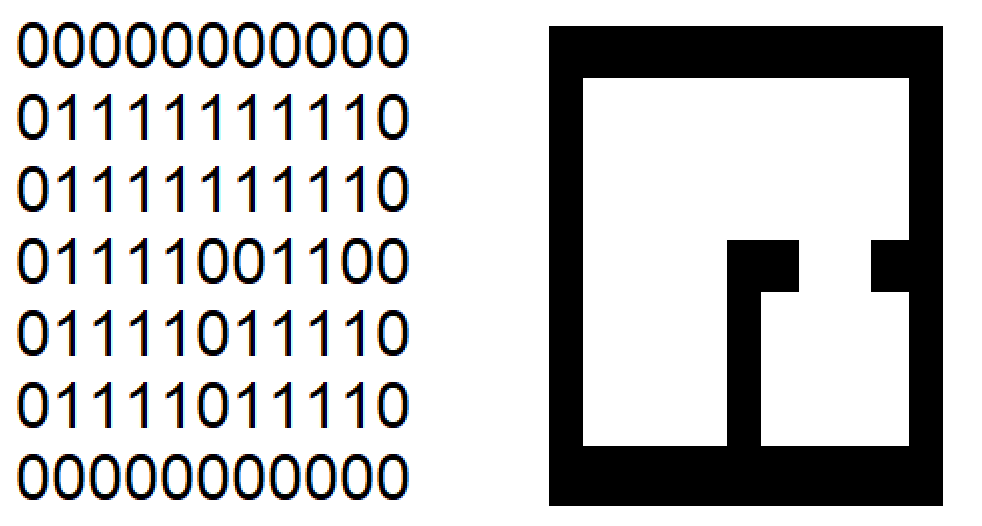

<h3>Descrição do Problema</h3>

Imagine que seja necessário programar um robô de limpeza. Esse robô deve realizar a limpeza
de uma área, sendo que ele não possui um mapa da área e nem sabe onde irá iniciar a limpeza.
Os únicos comandos possíveis são: 
* Ir para FRENTE
* Ir para TRÁS
* Ir para a DIREITA
* Ir para a ESQUERDA
* LIMPAR

<h4>Detalhamento do problema</h4>

Áreas são representadas por uma matriz de números inteiros onde:
* O tamanho (limite) da matriz determina o limite da área;
* O número **0** (zero) representa obstáculos em determinada área ou também o limite da área, por exemplo, paredes;
* O número **1** (um) representa um espaço sujo na área;
* E por fim, o número **2** representa um espaço limpo na área.

**Exemplo**

São 4 tipos diferentes de áreas. (Ver a pasta Resources) 
Para auxiliar na limpeza das áreas foi criado um robô.

<h3>Objetivo</h3>

Implemente a função de limpeza do robô para que o mesmo limpe determinada área, ou seja, faça a substituição
das posições da matriz com valor **1** (um) para o valor **2** (dois)

<h3>Regras</h3>

* Não é permitido alterar nenhuma das classes iniciais, com exceção da classe AppStart
* Não é permitido realizar a leitura dos mapas existentes no diretório **resources**
* A criação de classes novas é permitido
* É possível utilizar uma função que retorna a posição do robô em relação à matriz

Boa sorte! XD